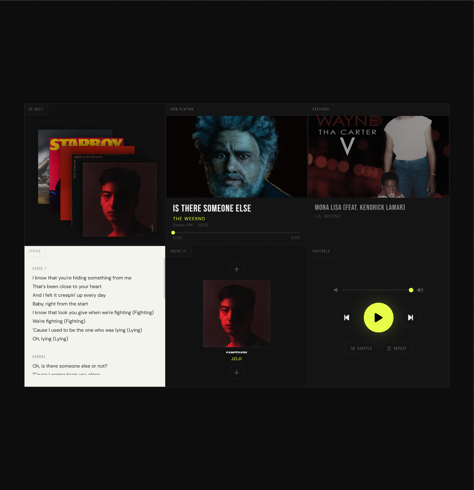

# Interactive Music Player 🎵

A custom-built, visually rich music player built with vanilla HTML, CSS, and JavaScript. Features a dark aesthetic with album art display, synchronized lyrics, queue management, and full playback controls.



## Features

- 🎨 **Dynamic album art** display for Now Playing, Up Next, and Previous tracks
- 📝 **Synchronized lyrics** panel with verse/section labels
- 📋 **Queue management** — scroll through and reorder upcoming tracks
- 🔊 **Volume control** with a draggable slider
- ⏮ ⏯ ⏭ **Playback controls** — previous, play/pause, next
- 🔀 **Shuffle** and 🔁 **Repeat** toggle support
- ⏱ **Progress bar** with current time and duration display

## Project Structure

```
Interactive Music Player/
├── index.html       # Main HTML layout
├── style.css        # Styles and dark theme
├── script.js        # Core playback logic
├── script2.js       # Additional UI/interaction logic
├── lyrics.js        # Lyrics data for each track
├── Images/          # Album artwork
│   ├── House-of-Balloons.webp
│   ├── glimpse-of-us.jpg
│   ├── starboy.jpg
│   └── ...
└── MP3/             # ⚠️ Audio files — NOT included (see below)
```

## ⚠️ Audio Files — Not Included

The `MP3/` folder is excluded from this repository because the songs are commercially copyrighted. To run this player locally, you will need to supply your own audio files.

### Expected tracks (by filename)

```
MP3/
├── - SiR - Hair Down (Lyric video).mp3
├── d4vd - Here With Me [Official Music Video].mp3
├── d4vd - Romantic Homicide.mp3
├── Frank Ocean - White Ferrari (Lyrics).mp3
├── Joji -  Glimpse of Us.mp3
├── Lil Wayne - A Milli.mp3
├── Lil Wayne - Mona Lisa ft. Kendrick Lamar.mp3
├── SiR - D'Evils (Lyrics).mp3
├── SiR - That's Why I Love You (Official Video) ft. Sabrina Claudio.mp3
├── The Weeknd - Call Out My Name (Official Video).mp3
├── The Weeknd - Is There Someone Else_ (Audio).mp3
├── The Weeknd - Starboy ft. Daft Punk (Official Video).mp3
├── The Weeknd - The Morning.mp3
└── The Weeknd - Wicked Games (Official Video - Explicit).mp3
```

Either add your own files with the exact same names, or update the track list in `script.js` to match your filenames.

## Getting Started

1. Clone the repository:
   ```bash
   git clone https://github.com/YOUR_USERNAME/interactive-music-player.git
   cd interactive-music-player
   ```

2. Add your own MP3 files to the `MP3/` folder (see filenames above).

3. Open `index.html` in your browser — no build step or server required.

> **Tip:** Some browsers restrict local file access. If audio doesn't load, try running a simple local server:
> ```bash
> npx serve .
> # or
> python -m http.server 8080
> ```

## Tech Stack

- **HTML5** — semantic layout and `<audio>` API
- **CSS3** — custom dark theme, grid layout, transitions
- **Vanilla JavaScript** — no frameworks or dependencies

## Credits

All music belongs to their respective artists and labels. This project is for personal/educational use only and does not redistribute any audio content.

| Song | Artist | Album |
|------|--------|-------|
| Wicked Games | The Weeknd | House of Balloons (2011) |
| Glimpse of Us | Joji | Smithereens (2022) |
| Hair Down | SiR | Chasing Summer (2019) |
| White Ferrari | Frank Ocean | Blonde (2016) |
| Here With Me | d4vd | Petals to Thorns (2023) |
| Romantic Homicide | d4vd | Petals to Thorns (2023) |
| A Milli | Lil Wayne | Tha Carter III (2008) |
| Starboy | The Weeknd ft. Daft Punk | Starboy (2016) |
| *(and more...)* | | |

## License

This project's **code** is open source under the [MIT License](LICENSE). Audio files and album artwork are © their respective rights holders and are not covered by this license.
